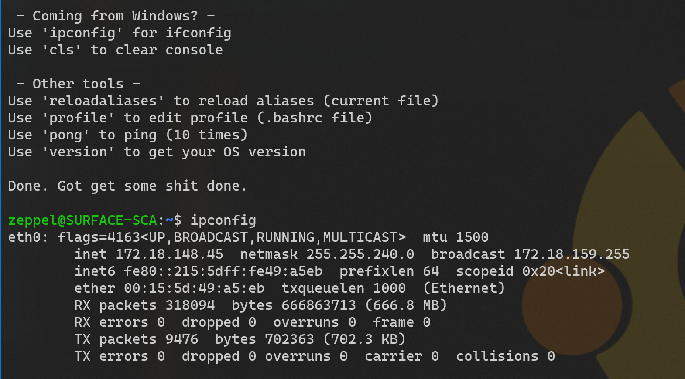

# Linux

## Tips and Tricks

Here are the Linux pages:

* [Tips & Tricks](./tips-tricks.md)

## Profile & Aliases

The `.bashrc` file is run each time you connect.
It will look for a `.bash_aliases` file.
If it's there, it will run it too.

> That is where you can se your custom aliases.

Here is an example file: [bash_aliases](./bash_aliases.sh).

