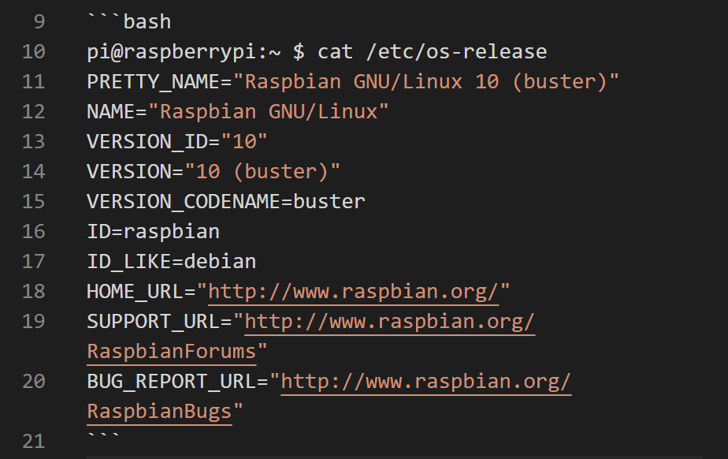

# Markdown tips and trick

## Syntax

Fenced code blocks should have a language specified ([MD040](https://github.com/DavidAnson/markdownlint/blob/main/doc/Rules.md#md040---fenced-code-blocks-should-have-a-language-specified)). For instance:  

  
